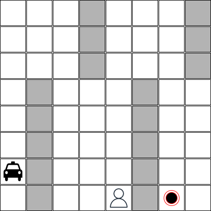

[Fabrício Jailson Barth, Dr.](http://lattes.cnpq.br/3446364988774155).
Rinforcement Learning. [Insper](https://github.com/Insper), 2023.

# Taxi Driver

[](https://classroom.github.com/a/2z7X09GL)

[](.github/workflows/pytest.yml)

Implementação de um agente taxista que pode pegar um passageiro em um ponto e
deixar este passageiro em outro ponto considerando um mapa específico. Um
exemplo de mapa é apresentado abaixo:



O agente taxista pode executar as seguintes ações:

- `GO_DOWN`: o resultado da execução desta ação é mover o táxi para uma linha
  abaixo;
- `GO_UP`: o resultado da execução desta ação é mover o táxi para uma linha
  acima;
- `GO_RIGHT`: o resultado da execução desta ação é mover o táxi para uma coluna
  à direita;
- `GO_LEFT`: o resultado da execução desta ação é mover o táxi para uma coluna à
  esquerda;
- `PICK_PASSENGER`: o táxi só pode executar esta ação se estiver na mesma
  posição que o passageiro e o passageiro não estiver dentro do táxi. Após a
  execução desta ação, o passageiro estará dentro do táxi;
- `DROP_PASSENGER`: o táxi só pode executar esta ação se o passageiro estiver
  dentro do táxi. O resultado da execução desta ação é deixar o passageiro na
  mesma posição que o táxi.

O resultado deste programa é imprimir uma lista de passos que o taxista deve
seguir para concluir seu objetivo.

## Metodologia

Este programa utiliza uma heurística de Busca Informada para encontrar o caminho
para o objetivo. O algoritmo opera sobre um grafo que representa o estado atual
do mapa e as possíveis transições entre células da grade do mapa. Então o grafo
é inundado, propagando os índices da célula da origem onde o taxi se encontra
até a célula alvo, como a do passageiro ou do alvo final, de forma gradual. Ou
seja, a inundação começa na célula do taxi, então vai para as células vizinha,
as vezinhas da úlima iteração e assim em diante. Assim que uma das celulas
atinge o alvo, a inundação é encerrada e obtém-se um conjunto de células
candidatas para se encontrar o caminho entre o taxi e o alvo. Esta heurística
permite sessionar a grade em uma região útil.

A partir da região, é feito um subgrafo que representa tal região, a partir dela
é possível executar o traçado do caminho até o objetivo. cada célula da grade
possui identificação no grafo de acordo com dua linha e coluna, incrementando
horizontalmente de cima para baixo da esquerda para a direita. A partir disso é
possível estabelecer uma equivalência entre os nós do grafo original e do grafo
resumido qual é representado na da forma de uma matriz quadrada de tamanho
proporcional a área da grade. Segue uma matrix que representa uma grade 5x5 sem
objstáculos, cujo caactere `#` representa uma possível transição a partir da
célula da linha atual:

```txt
1  - . # . . . # . . . . . . . . . . . . . . . . . . . 
2  - # . # . . . # . . . . . . . . . . . . . . . . . . 
3  - . # . # . . . # . . . . . . . . . . . . . . . . . 
4  - . . # . # . . . # . . . . . . . . . . . . . . . . 
5  - . . . # . . . . . # . . . . . . . . . . . . . . . 
6  - # . . . . . # . . . # . . . . . . . . . . . . . . 
7  - . # . . . # . # . . . # . . . . . . . . . . . . . 
8  - . . # . . . # . # . . . # . . . . . . . . . . . . 
9  - . . . # . . . # . # . . . # . . . . . . . . . . . 
10 - . . . . # . . . # . . . . . # . . . . . . . . . . 
11 - . . . . . # . . . . . # . . . # . . . . . . . . . 
12 - . . . . . . # . . . # . # . . . # . . . . . . . . 
13 - . . . . . . . # . . . # . # . . . # . . . . . . . 
14 - . . . . . . . . # . . . # . # . . . # . . . . . . 
15 - . . . . . . . . . # . . . # . . . . . # . . . . . 
16 - . . . . . . . . . . # . . . . . # . . . # . . . . 
17 - . . . . . . . . . . . # . . . # . # . . . # . . . 
18 - . . . . . . . . . . . . # . . . # . # . . . # . . 
19 - . . . . . . . . . . . . . # . . . # . # . . . # .
20 - . . . . . . . . . . . . . . # . . . # . . . . . #
21 - . . . . . . . . . . . . . . . # . . . . . # . . .
22 - . . . . . . . . . . . . . . . . # . . . # . # . .
23 - . . . . . . . . . . . . . . . . . # . . . # . # .
24 - . . . . . . . . . . . . . . . . . . # . . . # . #
25 - . . . . . . . . . . . . . . . . . . . # . . . # .
```

No subgrafo, a partir da célula de origem, a próxima será dada pelo nó mais
próximo em direção ao objetivo. Ou seja a próxima iteração será dada pelo
próximo nó com identificador que se aproxima do alvo. Caso não haja candidatos
ou todos já foram analisados, ou seja o programa está preso ou em loop, o nó é
removido e adicionado a uma lista de rejeição não podem ser analisado novamente.
Este processo segue até que se atinga o alvo. Este processo resulta em uma lista
com uma sequencia de identificadores que levam da origem até o alvo em
sequências de ações válidas de acordo com as restrições.

Esta sequência de etapas é repetida da origem do taxi até o passageiro,
adiciona-se a ação de embarcar o passageiro. Então é feita novamente até o
desino final e adiciona-se a ação de desembarcar o passageiro do taxi.

## Instalando dependências

```sh
pip install -r requiremens.txt
```

## Executando o programa

```sh
python src/main.py data/testcase_0.txt
```

## Rotina de testes

```sh
pytes -s
```
